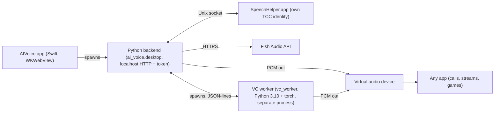

# AI Voice architecture

User guide: [README.md](README.md). Contributing: [CONTRIBUTING.md](CONTRIBUTING.md).

## Processes

The Swift shell creates an AppKit window with a WKWebView and launches the Python backend with the shell's PID; the
shell exits together with the backend. The backend serves the UI (from `macos/desktop/`, scripts inlined) on
127.0.0.1 with a random per-launch token. Speech recognition runs in a separate signed `SpeechHelper.app` with its
own microphone permission (TCC) identity, connected over a Unix socket. The optional Live voice worker runs under
its own isolated Python 3.10 environment with PyTorch and starts only on demand.

## Data flow

**Speech mode:** microphone → SpeechHelper (Apple Speech) → backend ASR events → transcript committer (only final
utterances, once per recognizer session) → Fish streaming TTS → bounded PCM ring → nonblocking PortAudio callback →
virtual audio device. With the monitor enabled, the playback callback fans out raw pre-gain PCM exactly once to a
separate monitor sink with its own resampling worker and gain, so the main output never depends on the monitor
device. Typed text (up to 1000 characters) skips recognition and enters the same TTS/playback path.

**Live voice mode:** microphone frames → noise gate → RVC or Seed-VC conversion in the VC worker (causal fixed-hop
streaming with SOLA overlap) → virtual audio device. The backend only orchestrates the worker over a JSON-lines
protocol; all ML code, model checkpoints and audio streams live in the worker process.

Nothing is recorded: transcripts and audio live in memory only and are never written to disk.

## Modules

Main backend (`src/ai_voice/`):

| File | Purpose |
|---|---|
| `__init__.py` | Local speech-to-Fish voice bridge; package version. |
| `asr.py` | Bridge to the signed macOS Speech helper process; keeps no recordings or transcripts. |
| `catalog.py` | Public Fish voice catalog and non-secret desktop preferences. |
| `cli.py` | Local command-line entry point. |
| `config.py` | Validated settings; no secrets or live device changes. |
| `desktop.py` | Authenticated localhost bridge for the native macOS window. |
| `desktop_control.py` | Single audio owner and serialized desktop commands; no capture on startup. |
| `devices.py` | Read actual PortAudio/CoreAudio devices without altering them. |
| `driver.py` | Install and inspect the bundled virtual microphone through the macOS admin prompt. |
| `fish_tts.py` | Fish HTTP streaming PCM with bounded pre-audio retries. |
| `gui_audio.py` | Live voice switching and typed utterances over the existing audio engine. |
| `hf_catalog.py` | Anonymous Hugging Face RVC catalog; no downloading, torch, or audio devices. |
| `hf_readme.py` | Parse Hugging Face model card Markdown for display in the UI. |
| `i18n.py` | Shared locale dictionaries for backend messages. |
| `instance.py` | Exclusive audio ownership shared by desktop and command-line launches. |
| `keys.py` | Format check, network verification and Keychain storage of the API keys; values never logged or returned. |
| `monitor.py` | Optional local monitoring of synthesized output on a separate device. |
| `paths.py` | Where code, UI, helper and user data live (development checkout vs packaged app). |
| `pipeline.py` | Ordered final-utterance synthesis and paced playback; no persisted speech. |
| `playback.py` | Bounded PCM ring and nonblocking PortAudio playback callback. |
| `preview.py` | Dedicated short-clip preview sink independent from the main pipeline. |
| `secrets.py` | Keychain access without exposing values in process arguments or output. |
| `storage.py` | Disk usage of everything AI Voice keeps on this Mac, with safe clearing. |
| `transcript.py` | Commit only final utterances, once per recognizer session identity. |
| `tts_cache.py` | In-memory LRU cache of short synthesized phrases (never written to disk). |
| `updates.py` | GitHub release checks with an opt-out and a persisted daily cache. |
| `usage.py` | Per-day count of synthesized characters (numbers only, never phrase text). |
| `vc_control.py` | HTTP orchestration for the voice-conversion mode. |
| `vc_engine.py` | Pinned, resumable installer for the optional live-voice runtime. |
| `vc_meter.py` | Lightweight input level meter, with no conversion or output stream. |
| `vc_omp.py` | Use torch's OpenMP runtime for the VC environment's bundled libraries. |
| `vc_store.py` | Local VC assets (imported models, zero-shot references); no torch, network, or microphone here. |
| `vc_train.py` | Single-job offline training supervisor; ML lives in the child process. |

Live voice worker (`vc_worker/`, runs under a separate interpreter):

| File | Purpose |
|---|---|
| `__init__.py` | Isolated voice conversion worker; importing this package never imports torch. |
| `__main__.py` | Worker entry point. |
| `engines.py` | Lazy loaders; engine code and checkpoints stay outside the main application. |
| `f0_safe.py` | F0 post-processing for RVC that tolerates fully unvoiced blocks. |
| `gate.py` | Frame-based noise gate; levels are measured before gain is applied. |
| `protocol.py` | JSON-lines control service; stdout is exclusively protocol events. |
| `runtime.py` | Worker-owned sounddevice streams and bounded queues. |
| `rvc_adapter.py` | RVC v2/RMVPE MPS adapter (MIT upstream). |
| `seed_adapter.py` | Seed-VC tiny MPS adapter (GPL-3.0 upstream; personal use only). |
| `streaming.py` | Causal fixed-hop conversion and normalized-correlation SOLA. |
| `train_mps.py` | Adapted copy of RVC `train.py` (MIT upstream) for Apple silicon MPS training. |
| `train_runner.py` | Offline RVC pipeline; runs only with the isolated worker interpreter. |

## Where data lives

The packaged app keeps everything in `~/Library/Application Support/AI Voice/`:

- `desktop.json` — preferences and added voices.
- Caches — voice metadata, the daily update-check result.
- `vc-voices/` — imported, zero-shot and trained Live voice models.
- `vc-runtime/` — the downloaded Live voice engine (Python 3.10, PyTorch, RVC and Seed-VC code, base models).
- `logs/` — app logs.

API keys live only in the macOS Keychain (service `ai-voice/*`). Nothing is read from or written into the app
bundle. A development checkout keeps its data in `state/` inside the repository instead.

## Security model

- The backend serves a single localhost page protected by a random per-launch window token; every request must
  match the exact Host and Origin and present the token.
- A strict Content-Security-Policy; the page loads no external scripts or styles.
- API keys are written to and read from the Keychain only; key values are never sent to the web UI, logged, or
  returned by any endpoint.
- External links open in the default browser, and only for allow-listed hosts.
- Speech recognition runs in a separate helper with its own TCC identity, so the microphone permission prompt
  names the helper, not the whole app.

## Adding a UI language

1. Copy `src/ai_voice/locales/en.json` to `<code>.json` and translate every value.
2. Add the language code to `LANGUAGES` in `src/ai_voice/i18n.py`.
3. Run `.venv/bin/python -m pytest tests/test_i18n.py` to verify all locale dictionaries have matching keys.

## Releases

Maintainers publish versions with tags. Pushing a `v*` tag triggers the release workflow
(`.github/workflows/release.yml`), which builds and signs the app on an Apple silicon runner and attaches
`AI-Voice-X.Y.Z.zip` plus its `.sha256` checksum to a GitHub Release. The in-app update check polls these releases.
