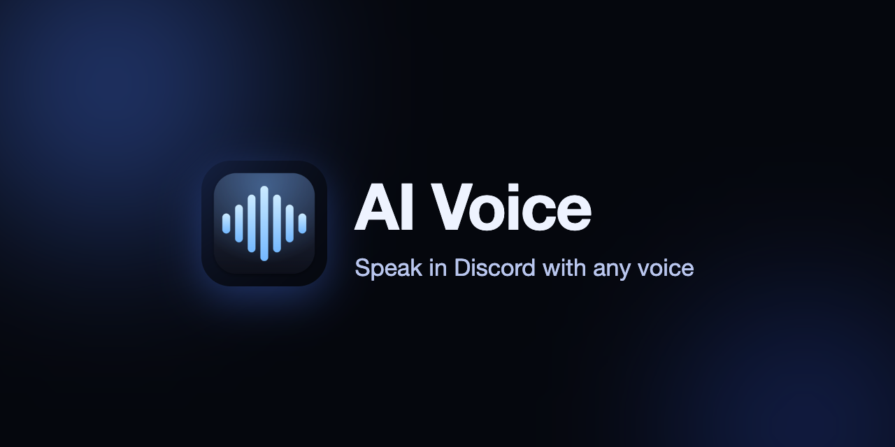
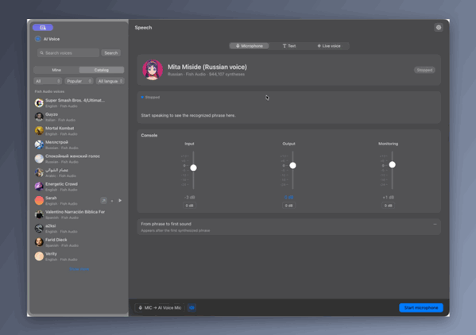
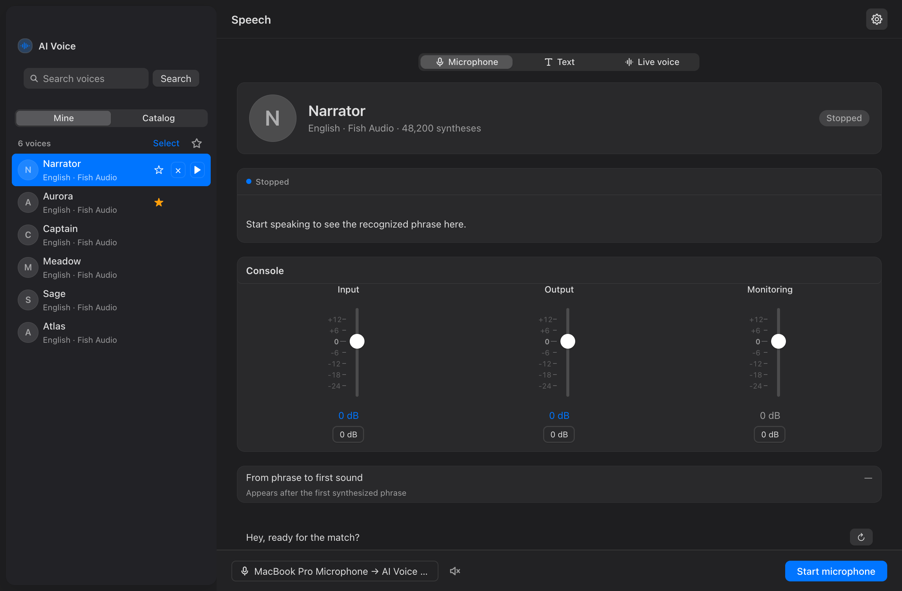
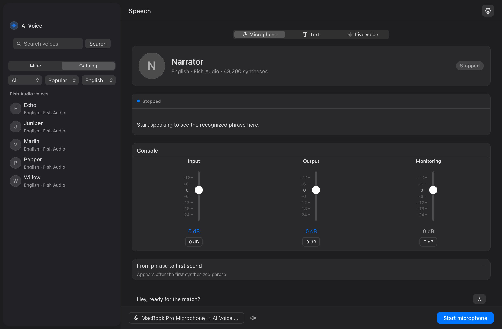
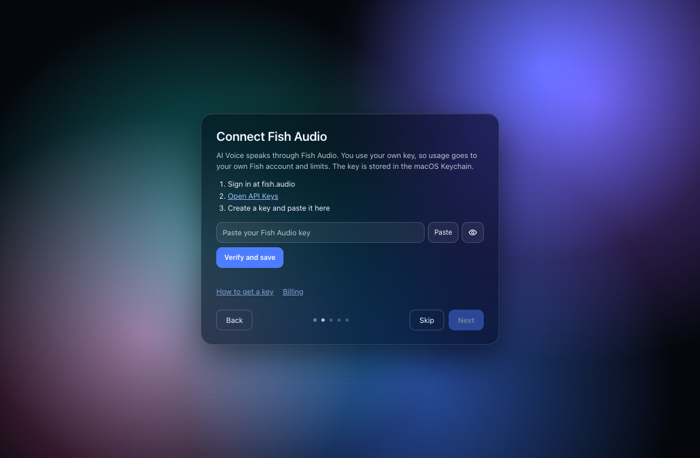
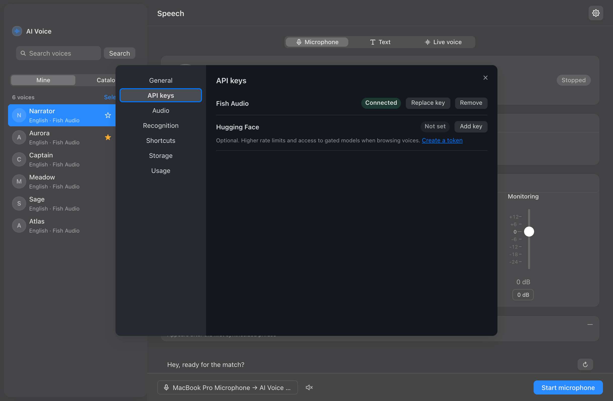
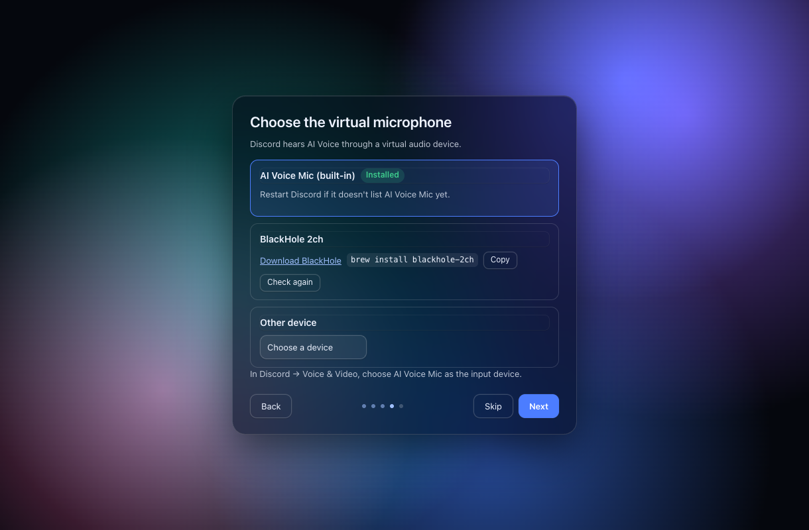
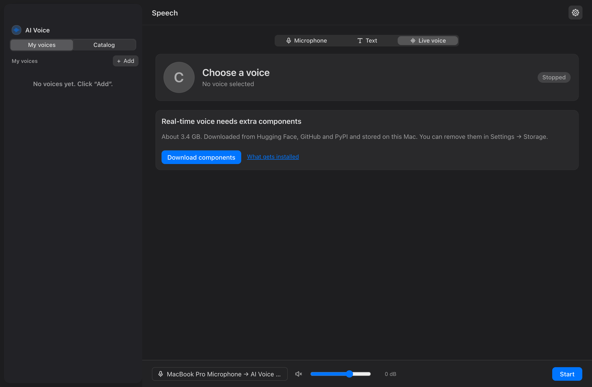
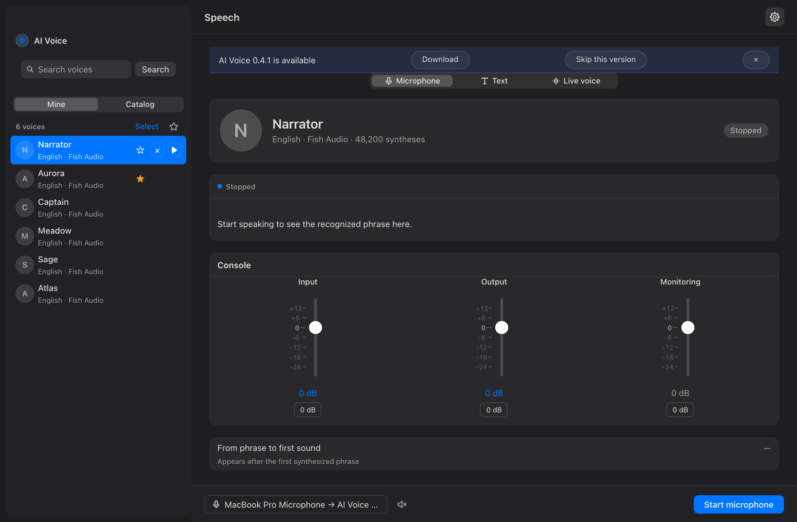

[English](README.md) | Русский



[](https://github.com/coldmoth/ai-voice/releases/latest)
[](LICENSE)
[](https://github.com/coldmoth/ai-voice/actions/workflows/ci.yml)


# AI Voice

Вы говорите (или печатаете), macOS распознаёт вашу речь, [Fish Audio](https://fish.audio) озвучивает её выбранным голосом, а результат уходит в виртуальный микрофон, который любое приложение — звонок, стрим, игра — может использовать как источник звука. Отдельный экспериментальный режим **«Живой голос»** преобразует ваш голос в реальном времени прямо на этом Mac.



## Возможности

- **Голосовой или текстовый ввод** — говорите в микрофон или введите до 1000 символов и нажмите «Озвучить текст».
- **Тысячи голосов Fish Audio** с поиском, фильтрами и демозаписями, плюс голоса из вашего аккаунта Fish.
- **Избранное** и **смена голоса горячей клавишей** прямо посреди звонка.
- **Прослушивание** — слышите новый голос в наушниках, а звук виртуального микрофона при этом не меняется.
- **Учёт расхода и лимитов** символов Fish Audio.
- **«Живой голос»** (экспериментальный, Apple silicon): преобразование голоса в реальном времени, работает локально на моделях RVC и Seed-VC.
- **Интерфейс на русском и английском.**
- **Ключи хранятся в Связке ключей macOS**, а не в файлах.




## Требования

- macOS 13 или новее, Apple silicon (публикуемая сборка — только arm64; «Живой голос» тоже требует Apple silicon).
- Аккаунт [Fish Audio](https://fish.audio) с API-ключом. Платное использование Fish Audio списывается с вашего собственного счёта.
- Любое приложение, которое принимает микрофонный вход.

## Установка

1. Скачайте `AI-Voice-X.Y.Z.zip` со страницы [релизов](https://github.com/coldmoth/ai-voice/releases/latest).
2. Распакуйте архив и перенесите **AI Voice.app** в «Программы».
3. При первом запуске:
   - macOS 13–14: правый клик по приложению → **Открыть** → **Открыть**.
   - macOS 15+: попробуйте открыть приложение один раз, затем зайдите в **Системные настройки → Конфиденциальность и безопасность** и нажмите **Все равно открыть**.

   Альтернатива: `xattr -dr com.apple.quarantine "/Applications/AI Voice.app"`.

**Почему появляется предупреждение?** Приложение не нотаризовано — за ним не стоит платный аккаунт Apple Developer. Оно собирается из этого репозитория через GitHub Actions (см. [запуски релизного процесса](https://github.com/coldmoth/ai-voice/actions/workflows/release.yml)), а к каждому релизу прилагается файл `.sha256`, по которому можно проверить скачанное.

## Первый запуск

Экраны настройки проведут вас через выбор языка, разрешения, ключ Fish Audio и виртуальный микрофон. Каждый шаг можно пропустить, а настройку позже запустить заново: **Настройки → Общие → «Настроить заново»**.



- **Язык** — интерфейс на английском или русском.
- **Разрешения** — микрофон и распознавание речи; их запрашивает отдельный помощник, чтобы macOS показала понятный запрос.
- **Fish Audio** — вставьте API-ключ; он хранится в Связке ключей macOS, а расход идёт на ваш аккаунт Fish и его лимиты. Управлять ключами можно позже в **Настройки → API-ключи**.
- **Виртуальный микрофон** — выберите устройство, которое услышат другие приложения (см. следующие разделы).



## Использование в других приложениях

В настройках звука приложения выберите виртуальное устройство как микрофон (устройство ввода): **AI Voice Mic** (встроенное), **BlackHole 2ch** или ваше устройство Loopback.

Для лучшего качества отключите в приложении шумоподавление и эхоподавление (это рекомендация, а не требование).

## Виртуальное аудиоустройство

Между AI Voice и другими приложениями нужно виртуальное аудиоустройство. Есть три варианта:

| Вариант | Плюсы | Минусы |
|---|---|---|
| **AI Voice Mic (встроенный)** | Один клик в настройках, ничего скачивать не нужно | Попросит пароль администратора Mac; при установке аудиоустройства на пару секунд перезагружаются |
| **BlackHole 2ch** | Бесплатный, широко используется | Отдельная загрузка и установщик |
| **Другое (например, Loopback)** | Гибкая маршрутизация | Ручная настройка; Loopback платный |

Встроенный драйвер — это [BlackHole](https://existential.audio/blackhole/) v0.7.1, переименованный в `AIVoiceMic.driver`. Установить или удалить его можно в **Настройки → Аудио → Виртуальный микрофон**. Чтобы удалить вручную, удалите `/Library/Audio/Plug-Ins/HAL/AIVoiceMic.driver` и выполните `sudo killall coreaudiod`.



<a id="live-voice-engine"></a>

## Движок «Живого голоса»

«Живой голос» — режим необязательный и экспериментальный. Кнопка **«Скачать компоненты»** устанавливает в `~/Library/Application Support/AI Voice/vc-runtime`:

- Python 3.10 с PyTorch (через [uv](https://github.com/astral-sh/uv)),
- исходный код RVC и Seed-VC,
- базовые модели с Hugging Face — около 3,4 ГБ всего.

Всё остаётся на этом Mac, преобразование идёт локально. Удалить компоненты можно в **Настройки → Хранилище**. Модели голосов берутся из каталога Hugging Face внутри приложения или из ваших собственных записей. Предпочитаете терминал? `scripts/install-vc-engine.sh` выполняет ту же установку.



## Обновления

Приложение раз в день проверяет GitHub Releases и показывает баннер, когда выходит новая версия. Само оно ничего не устанавливает. Отключить проверку можно в **Настройки → Общие → «Проверять обновления автоматически»**.



## Конфиденциальность

- Никакой телеметрии, аккаунтов и аналитики.
- Сетевые запросы идут только к: Fish Audio (синтез речи и каталог голосов), распознаванию речи Apple (на устройстве или на серверах Apple — зависит от настроек macOS), GitHub (проверка обновлений) и Hugging Face (каталог голосов и загрузка движка).
- API-ключи хранятся только в Связке ключей macOS.
- Аудио и расшифровки речи не сохраняются на диск.

## Ответственное использование

Используйте собственный голос или голоса, на которые у вас есть права. **Не выдавайте себя за реальных людей**, не обманывайте, не преследуйте, не мошенничайте и не обходите голосовую верификацию. Соблюдайте условия использования Fish Audio и приложений, в которых вы его используете. У голосовых моделей с Hugging Face свои лицензии — проверяйте их перед использованием. Авторы не несут ответственности за злоупотребления.

## Сборка из исходников

```sh
brew install uv
git clone https://github.com/coldmoth/ai-voice.git
cd ai-voice
python3 -m venv .venv && .venv/bin/pip install -e '.[test]'
scripts/build-app.sh
scripts/install-app.sh
```

Тесты запускаются командой `.venv/bin/python -m pytest -q`. Во время разработки `make watch` автоматически пересобирает приложение при изменении файлов.

Как всё устроено внутри — в [ARCHITECTURE.md](ARCHITECTURE.md), как помочь проекту — в [CONTRIBUTING.md](CONTRIBUTING.md).

## Лицензия

[GPL-3.0](LICENSE).

**Благодарности:** [Fish Audio](https://fish.audio), [BlackHole](https://existential.audio/blackhole/) от Existential Audio, [RVC Project](https://github.com/RVC-Project/Retrieval-based-Voice-Conversion-WebUI), [Seed-VC](https://github.com/Plachtaa/seed-vc), [uv](https://github.com/astral-sh/uv). Проект не связан с Fish Audio.
